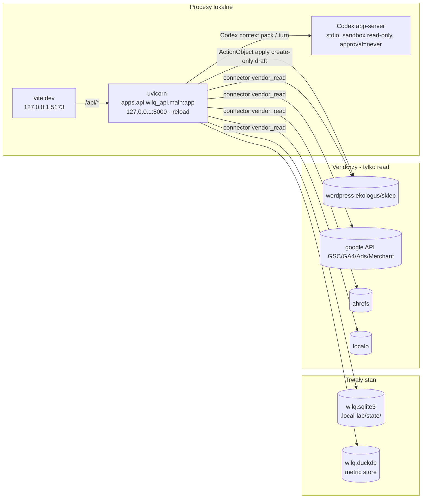
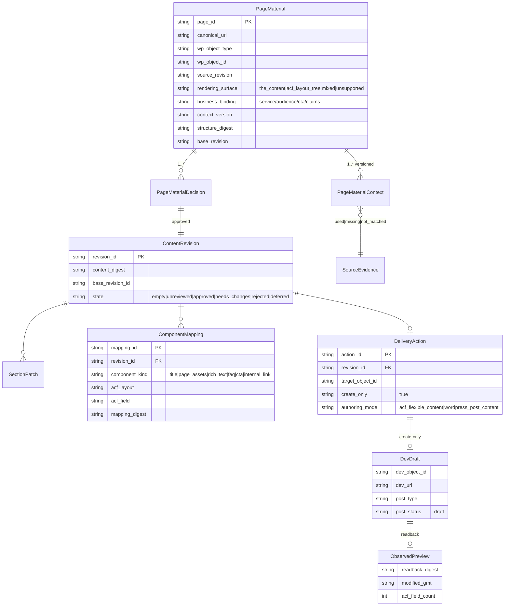

# Architecture Discovery Packet — WILQ vNext

Rola dokumentu: `decision/reference`. Stan na: 2026-08-07, fixed point `a783efe0`
(lokalny HEAD; 5 commitów przed `origin/main`). Jest to artefakt discovery
read-only, **nie** plan wdrożenia uprawniający do zapisu. Nie zawiera wartości
sekretów; zawiera wyłącznie nazwy zmiennych i konfiguracji.

Ten dokument nie zastępuje `docs/CONTEXT.md`, `docs/current-cleanup-state.md`
ani decyzji z Beads. Czyta się go razem z nim jako evidence-bound mapę migracji
do prostszego, produkcyjnego systemu domykającego jeden pełny workflow:

```text
ekologus.pl (źródło) + connectorzy marketingowi
  → decyzja, dla której strony warto pracować
  → pełny materiał strony i jej struktura
  → przygotowany dokument / patch sekcji
  → merytoryczny review człowieka
  → wyłącznie nowy draft na ekologus.dev.proudsite.pl
  → dokładny preview i readback
```

## Spis treści

1. Executive verdict
2. Faktyczny as-is map
3. Connector & configuration migration matrix
4. PageMaterial domain model + entity/relation
5. `the_content` delivery contract
6. ACF/flexible-content delivery contract + blocker rules
7. API boundary: resource/command schemas + event/audit model
8. Wybrany stack vNext + odrzucone alternatywy
9. Legacy extraction ledger (port/extract/reference/delete)
10. Migration sequence: slice'y, zależności, rollback, cutover
11. Quality gate matrix
12. Open decisions — owner required, evidence needed

---

## 1. Executive verdict

Hipotezy z zlecenia zweryfikowane w kodzie i przez read-only endpointy. Większość
„problemów do naprawy" jest **już częściowo lub całkowicie rozwiązana** w obecnym
repozytorium; głównym problemem nie jest brak funkcji, lecz **rozdzielona
persistence** (payload-based SQLite + DuckDB), **brak jednoznacznego modelu
„materiału strony"** łączącego dokument z kontekstem renderingu oraz **test i
doc debt** maskujący stan.

### Co zachować (bez zmiany semantyki)

- **API-first monolit z cienkimi routerami**: `apps/api/wilq_api/` → domena w
  `wilq/`. Architektura już jest „server-owned".
- **Immutable revisions** (`ContentDraftRevision`, append-only, digest-bound) —
  to dokładnie model „propozycji/rewizji" z zamówienia.
- **Exact human review** jako jedyna authority approval (`revision_id + digest`).
- **ActionObject lifecycle** (validate → preview → review → confirm → impact →
  apply) z audit trail — kontrakt pasuje do zamówienia.
- **Create-only dev draft granica** WordPress: host allowlist
  `ekologus.dev.proudsite.pl`, `create_only=True`, `publish/update/delete` zablokowane,
  readback po create.
- **ACF clone projection** (`ContentAcfClonePlan` + `compile_acf_clone_payload`):
  pełny page-level patch przez deepcopy pełnego snapshotu + whitelist scalarnych
  replacement — blokuje partial clone i zgubienie nieedytowanych pól.
- **Evidence registry + freshness + redaction** — brak dowodu = typed blocker.
- **Shared-schemas (Zod) + dashboard parse-every-response** — jedyne miejsce
  prawdy kontraktu po stronie przeglądarki.

### Co zatrzymać / nie ruszać w tej fazie

- **Brak migracji storage** (bez zgody i okna). SQLite `user_version=3`,
  DuckDB `schema_version=1`.
- **Brak wdrożonej prawdy „materiału strony"** jako jednego trwałego rekordu —
  to jest zadanie vNext, nie patch w istniejącym monolicie.
- **Brak nowych endpointów dashboardu** bez konkretnego ryzyka operatora.
- **Nie uruchamiać żadnego vendor write** — poza już przetestowanym
  create-only draft dev (BDO `1932`, KIP `1934`, Ocena środowiskowa `1933`
  są dowodem, że mechanika działa).

### Co budować jako pierwsze

Dokładnie jeden vertical slice („vNext first slice", osobny dokument):

```text
read-only WordPress source inventory + PageMaterial snapshot
  → native the_content full-document revision
  → human review
  → ActionObject create-only draft on dev
  → exact REST readback + preview
```

Pierwszy slice **nie obejmuje pełnego ACF write**, ale zawiera read-only ACF
discovery, żeby następny slice pracował na prawdziwej strukturze.

### Kluczowe fakty zweryfikowane (2026-08-07)

- `scripts/lint.sh` — **zielony** (Python ruff + ESLint).
- `scripts/typecheck.sh` — **zielony** (mypy 464 pliki + TS).
- Skupione testy: `tests/content`, `tests/api_contracts`, planning input sources,
  ACF clone, target mapping, revisions, operator steps, ahrefs planning —
  **przechodzą**.
- **Jedna deterministyczna porażka** wykryta: `tests/content/test_work_item_preflight_api.py::test_content_work_item_snapshot_is_derived_from_content_diagnostics`.
  Pochodzenie: **zależność od `.env`/środowiska** — przechodzi z
  `WILQ_ENV_FILE=/dev/null`, pada z repo `.env` (topic snapshotu vs decyzji).
  Nie jest regresją ostatnich 5 commitów (na `48d8ebc3` też przechodzi).
  CI (bez `.env`) jest zielone; lokalnie gate jest **czerwony**. To jest ukryty
  red gate środowiskowy, nie produktowy.
- Runtime: API `127.0.0.1:8000` healthy, dashboard `127.0.0.1:5173` healthy.
  12 connectorów: 9 configured (w tym `openai_codex`), 2 missing creds
  (linkedin, facebook), 1 disabled (google_sheets). `openai_codex` jest
  status-only runtime i nie jest evidence source.
- Decyzje content: **53 decyzje, 52× `refresh_or_merge` z GSC+WordPress,
  1× `review_ahrefs_gap_records`**. GA4 jest `settling/unverified` (blokada
  kontraktowa), Ahrefs typed-blocked, Ads/Planner zablokowany tokenem dev.
  Hipoteza „decyzje głównie o GSC" — **potwierdzona** i zgodna z intencją
  (exact mapping), ale GA4/Ahrefs/Ads nie zasilają decyzji mimo istnienia
  connectorów.
- Metric store: 214 922 fakty, 5 065 refresh runs, 8 connectorów.
- Local stack: `uvicorn --reload` (API) + Vite (dashboard), zarządzane przez
  `scripts/local_stack.sh`.

---

## 2. Faktyczny as-is map

### 2.1 Moduły

| Warstwa | Ścieżka | Uwagi |
| --- | --- | --- |
| Public API (FastAPI) | `apps/api/wilq_api/` | `main.py` = montaż routerów + loopback middleware; `routers/` = cienkie; `context_*.py` = skille/context packs |
| Domena + adaptery | `wilq/` | `connectors/`, `evidence/`, `actions/`, `audit/`, `content/`, `knowledge/`, `jobs/`, `workflows/`, `credentials/`, `security/`, `schemas/`, `codex/`, `briefing/`, `opportunities/`, `expert/`, `social/`, `storage/`, `access_pack/` |
| Dashboard | `apps/dashboard/` | React 19 + TanStack Router + React Query, `src/lib/api.ts` parse-every-response |
| Shared schemas | `packages/shared-schemas/` | Zod mirror `wilq/schemas/*.py`; ręcznie utrzymywany |
| Runtime scripts | `scripts/` | `local_stack.sh`, `verify.sh`, `test.sh`, `lint.sh`, `typecheck.sh`, `security.sh`, `quality.sh`, evals |
| CI | `.github/workflows/quality.yml` | python + frontend + integration (verify) |
| Testy | `tests/` | public contracts + risk-focused |
| Skills (operator) | `.agents/skills/wilq-*/` | 13 skills, deterministyczne smokes |

### 2.2 Runtime i procesy



Kluczowe: **brak osobnego workera/daemona**. „Kolejki" (planning, initial draft)
są w-procesowe (`ThreadPoolExecutor`, in-memory claim). Scheduler APScheduler
**nie jest auto-startowany** (`autostart=False`; tylko `POST /api/jobs/{id}/run`).

### 2.3 Data stores

| Store | Plik | Engine | Schemat | Migracje |
| --- | --- | --- | --- | --- |
| State | `.local-lab/state/wilq.sqlite3` | SQLite | `PRAGMA user_version=3`; tabele `CREATE TABLE IF NOT EXISTS` w `wilq/storage/local_state.py` + `wilq/content/workflow/store_schema.py` | Brak katalogu migrations; tylko wersja gate (`reject_newer_sqlite_schema`) |
| Metric store | `.local-lab/state/wilq.duckdb` | DuckDB | `connector_metric_facts`, `wilq_schema_metadata` v1 | Jedna realna migracja `_v2` rebuild w `metric_store.py:662-725` |
| Content state | ten sam SQLite | — | `content_draft_revisions`, `_reviews`, `_apply_claims`, `_measurement_*`, `_target_mapping_confirmations`, planning jobs | append-only revisions, upserts |

**Czerwona flaga**: payload-based rows (`payload_json` kolumny), ręczne SQL,
brak katalogu migracji. To główny long-term storage debt.

### 2.4 Miejsca, w których stan jest kopiowany/odtwarzany

- `wilq/actions/action_catalog.py` — katalog akcji **nie jest persisted**;
  odtwarzany z bieżących metric facts (TTL 15s, `id(diagnostics)` cache key).
- Dev-draft akcje odtwarzane z `content_dev_draft_action_created` audit event.
- Evidence **nie jest własną tabelą** — projekcja read-time z connector
  status + refresh runs + DuckDB facts.
- `context_cache.py` — in-memory skill/full packs (300s/30s TTL).
- Content snapshot: `diagnostics_with_exact_gsc_demand` — 15s cache keyed
  `id(diagnostics)`.
- Revision state jest persisted (append-only) — **to jest jedyna prawda**.

### 2.5 Write-capable ścieżki (pełna lista)

| # | Ścieżka | Owner | Walidacja | Approval | Audit | Idempotencja | Rollback/recovery | Test |
| --- | --- | --- | --- | --- | --- | --- | --- | --- |
| 1 | `POST /api/connectors/{connector}/refresh` (vendor_read) | `wilq/connectors/refresh.py` | configured+read-only | nie (odczyt) | refresh run + evidence | per-connector dedupe (queued/running), TOCTOU | re-run; partial run oznaczany | `tests/connectors/*` |
| 2 | `POST /api/jobs/{job_id}/run` | `wilq/jobs/scheduler.py` | registry | nie | job run | agregacja po connectorach | retry per connector | `tests/test_jobs_scheduler.py` |
| 3 | `POST /api/workflows/{id}/runs` | `wilq/workflows/` | schemat | nie | workflow run | — | — | `tests/` |
| 4 | `POST /api/actions/.../validate|preview|review|confirm|impact-check|apply` | `wilq/actions/*` | evidence+connector+payload | preview→review→confirm→impact | audit events + mutation audit | claim (apply), digest binding | 300s reconcile dla apply | `tests/actions/*` |
| 5 | `POST /api/content/.../planning-proposals` | `wilq/content/planning/*` | exact input digest | plan review | planning job | in-memory claim + stale TTL | stale job TTL | `tests/content/test_dynamic_planning*` |
| 6 | `POST /api/content/.../draft-revisions` (editor save) | `wilq/content/workflow/store.py:append_draft_revision` | base revision + digest | nie (zapis) | workflow audit | digest idempotent + stale_base conflict | append-only | `tests/content/test_content_workflow_revisions.py` |
| 7 | `POST /api/content/.../draft-revisions/{rev}/review` | `store_revision_review.py` | exact digest + latest | **człowiek** | review record | base_decision_id | append-only | `tests/content/*` |
| 8 | `POST /api/content/.../target-mapping/confirmation` | `target_mapping.py` | digesty + exact scope | **człowiek** | confirmation | bindings | append-only | `tests/content/test_content_target_mapping.py` |
| 9 | `POST /api/content/.../target-mapping/draft-action` (ActionObject create) | `dev_draft_action.py` | binding + review gates | ActionObject lifecycle | audit | — | action rebuild | `tests/content/*` |
| 10 | `POST /api/actions/{id}/apply` → WordPress dev draft | `dev_draft_execution.py` + `client.create_wordpress_acf_draft/post` | host allowlist + draft-only + flags | full ActionObject chain | audit + mutation audit atomically | `claim_wordpress_revision_apply` | 300s reconcile | `tests/connectors/test_wordpress_draft_write.py` |
| 11 | `POST /api/content/dev-drafts/discard-action` | `dev_draft_discard_action.py` | readback digests, tylko WILQ-created | ActionObject | audit + fingerprint | origin action binding | trash (force=false) | `tests/content/test_dev_draft_discard_action.py` |
| 12 | `POST /api/knowledge/condense` | `wilq/knowledge/` | deterministyczny compile | nie | — | deterministyczny | — | `tests/knowledge/*` |
| 13 | `POST /api/social/*` | `wilq/social/` | review-only | review | audit | digest | — | `tests/` |
| 14 | `POST /api/content/private-source-reviews`, `public-source-reviews` | `wilq/content/knowledge/public_source_reviews.py` | redacted lineage | owner review | audit | append-only | — | `tests/content/test_public_source_review_promotion.py` |
| 15 | `POST /api/content/.../measurement-window|outcome|learning-proposal` | `store_measurement.py` | publication-bound | serwer-owned outcome | audit | digest | — | `tests/content/*` |

Wniosek: **tylko ścieżki 10 i 11 dotykają vendora** i obie są create-only / trash
na dev. Pozostałe zapisy to lokalny stan. To bardzo dobra podstawa vNext.

---

## 3. Connector & configuration migration matrix

Legenda akcji: **P** = portować bez zmian, **A** = zmienić adapter/umowę,
**D** = odroczyć, **U** = usunąć, **K** = zachować jako runtime (nie evidence).

| Connector ID | Rola biznesowa | Read/Write (stan) | Wymagane env (tylko nazwy) | Odświeżanie / rate / cost / risk | Evidence model | Czy zasila decyzję contentową dziś | Akcja vNext |
| --- | --- | --- | --- | --- | --- | --- | --- |
| `wordpress_ekologus` | źródło treści + dev draft | read+write (draft-only, pełny) | `WORDPRESS_EKOLOGUS_URL`, `_USERNAME`, `_APP_PASSWORD`, `_PUBLIC_URL`, opcjonalnie `_ACF_*`, `_ALLOW_DRAFT_WRITES`, `_AUTHORING_TARGET`, SSH/WP-CLI legacy | vendor_read, 48h freshness, żadnych kosztów | inventory facts + refresh evidence | **tak** (exact inventory, jedyne źródło PageMaterial) | **P** (usuń legacy SSH/WP-CLI paths w późniejszym slicie) |
| `wordpress_sklep` | sklep inventory | read (pełny) | `WORDPRESS_SKLEP_URL`, `_USERNAME`, `_APP_PASSWORD` | jak wyżej | inventory facts | nie (produkty) | **P** |
| `google_search_console` | zapytania/demand | read (pełny) | `GOOGLE_SEARCH_CONSOLE_SITE_URL` lub `GSC_SITE_URL` + Google creds | 48h, quota Search Analytics | query×page facts | **tak** (exact query rows) | **P** |
| `google_analytics_4` | zachowanie/konwersja | read (pełny) | `GA4_PROPERTY_ID` + Google creds | 48h, `settling` zawsze | landing behavior facts | **nie** — kontrakt `settling/unverified` blokuje `used` | **A** (napraw settlement/quality contract LUB jawne `not_matched`) |
| `google_ads` | kampanie/search terms | read (pełny), write **brak** | `GOOGLE_ADS_*` (dev token, client id/secret, refresh token, customer id, login id) | OAuth, koszty/limity | campaign/search-term facts | częściowo (search terms przy exact landing+service binding); Planner zablokowany tokenem | **A** (Keyword Planner jako osobny readiness gate) |
| `google_merchant_center` | produkty/feed | read (pełny) | `GOOGLE_MERCHANT_CENTER_ACCOUNT_ID` + Google creds | 48h | product status facts | nie (produkty, conditional) | **P** |
| `google_sheets` | opcjonalny export | read (metadata-only), **disabled** | `GOOGLE_SHEETS_*` | disabled scope | brak | nie | **D** (zostaw disabled) |
| `ahrefs` | konkurencja/gapy | read (pełny) | `AHREFS_API_TOKEN` (alias `AHREFS_API_KEY`), `AHREFS_TARGET` | płatne kredyty | domain/competitor/keyword facts | **nie** — typed blocked (cross-source match) | **A** (explicit `not_matched` przy PageMaterial bez matchu) |
| `localo` | lokalna widoczność | read (pełny, OAuth) | `LOCALO_API_TOKEN`, `LOCALO_ORGANIZATION_ID`, `LOCALO_ACCESS_TOKEN` | OAuth | visibility facts | nie (local conditional) | **P** |
| `linkedin` | social candidate | **stub** (no adapter) | `LINKEDIN_ORGANIZATION_ID`, `LINKEDIN_ACCESS_TOKEN` | — | brak | nie | **U** (skasuj stub albo D) |
| `facebook` | social candidate | **stub** (no adapter) | `FACEBOOK_PAGE_ID`, `FACEBOOK_PAGE_ACCESS_TOKEN` | — | brak | nie | **U** (skasuj stub albo D) |
| `openai_codex` | runtime model | status-only | brak env | local `codex` CLI + `codex login` | nie jest evidence | nie | **K** (runtime, zachować) |

### Plan bezpiecznej migracji konfiguracji do vNext

```text
legacy private .env / access pack (ekologus.env + credentials/)
  → names-only compatibility manifest (nazwy zmiennych, źródła, presence)
  → lokalny secrets provider vNext (process_env > repo_env > access_pack, bez wartości w UI/logach)
  → startup capability probe (czy connector jest skonfigurowany, nie czy działa vendor)
  → connector-specific readiness (freshness, missing_credentials jako nazwy)
```

Zasady (potwierdzone w `wilq/credentials/runtime.py`):

- Nie commitować `.env`, nie eksportować sekretów do Markdown, nie przekazywać
  reviewerowi wartości.
- `WILQ_ENV_FILE`, `WILQ_STATE_DB`, `WILQ_METRIC_DB`, `WILQ_ACCESS_PACK_PATH`
  zachować jako neutralne nazwy runtime.
- Zachować (kompatybilność): `WORDPRESS_EKOLOGUS_*`, `WORDPRESS_SKLEP_*`,
  `GSC_SITE_URL`, `GA4_PROPERTY_ID`, `GOOGLE_ADS_*`, `AHREFS_API_TOKEN`,
  `LOCALO_*`, `GOOGLE_MERCHANT_CENTER_ACCOUNT_ID`.
- Usunąć/odłożyć: legacy `EKOLOGUS_WP_STAGING_*` aliases, `MIS_*` aliases,
  `WORDPRESS_EKOLOGUS_SSH_*`, `WORDPRESS_EKOLOGUS_WP_CLI_*`,
  `WORDPRESS_EKOLOGUS_HELPER_PLUGIN_*`, `CODEX_API_KEY`/`OPENAI_API_KEY`
  (nie są używane przez Codex app-server; obecność w `.env` jest myląca).
- `WORDPRESS_EKOLOGUS_DOCROOT` i `WORDPRESS_EKOLOGUS_AUTHORING_TARGET` —
  zachować jako names-only capability, zweryfikować użycie przed usunięciem.

---

## 4. PageMaterial domain model + entity/relation

### 4.1 Model domenowy

Proponowany kanoniczny rekord `PageMaterial` (vNext) łączący to, co dziś jest
rozdzielone między `ContentWorkItem`/`ContentDraftRevision` a
`ContentTargetContract`/`ContentTargetAuthoringSurface`:



### 4.2 Rozdzielenie odpowiedzialności (kluczowa decyzja)

| Pojęcie | Definicja | Gdzie dziś | vNext |
| --- | --- | --- | --- |
| **Materiał strony** | rzeczywisty obiekt + bieżący kontekst (title, sekcje, pola ACF, kolejność, version snapshotu) | rozdzielone: `ContentWorkItem` (content) + `ContentTargetAuthoringSurface`/ACF snapshot (target) | jeden `PageMaterial` + wersjonowany `PageMaterialContext` |
| **Decyzja** | zachować / odświeżyć / scalić / stworzyć / zablokować | `ContentDecisionItem` (`decision_type`, `priority`, queue) | `PageMaterialDecision` powiązana z jednym materiałem; wynik = karta „zrób teraz / nie rób / czego brakuje" |
| **Propozycja/rewizja** | immutable pełny dokument lub patch | `ContentDraftRevision` (append-only, digest) | bez zmian (przenieść jako contract) |
| **Mapping** | explicite zatwierdzone przełożenie rewizji na rendering surface | `ContentTargetMappingSelection`/`Confirmation` + `ComponentMapping` | `ComponentMapping` (jeden rekord, digest) |
| **Delivery action** | jeden create-only draft na dev | `ContentDevDraftWritePayload` + ActionObject | bez zmian |
| **Observed preview** | readback faktycznego obiektu po delivery | `wordpress_draft_readback` | `ObservedPreview` (readback digest obowiązkowy) |
| **Measurement** | tylko po potwierdzonym deployment | `content_measurement_windows` | bez zmian (server-owned, publication-bound) |

Zakaz: **LLM nie wybiera pola ACF, autora content authority ani targetu
WordPressa**. Te decyzje należą do mapowania człowieka (`ComponentMapping`)
i ActionObject. Obecny kod to respektuje (`ContentTargetMappingConfirmation`
tylko z zatwierdzonych selekcji; `ComponentMapping` nie jest generowane przez
model).

### 4.3 Co dziś brakuje do pełnego PageMaterial

1. **Brak jednego trwałego rekordu** łączącego `ContentWorkItem` (źródło) z
   `ContentTargetAuthoringSurface` (target dev). Wiązanie odbywa się przez
   `binding_digest` w trakcie mapping preview — nie jest persisted jako materiał.
2. **Source ACF snapshot nie jest persisted** (świadomie: „never persisted" w
   `compile_acf_clone_payload`). Dla vNext `PageMaterialContext` powinien
   przechowywać **tylko digesty + nieedytowane pole identity**, nigdy surowy
   vendor payload. To zgodne z redaction policy.
3. **Rendering surface nie jest jawnym typem na materiale** — jest wnioskowane
   per-target (`authoring.py`, `target_discovery.py`). vNext: jawny enum
   `the_content|acf_layout_tree|mixed|unsupported` na `PageMaterial`.

---

## 5. Szczegółowy `the_content` delivery contract

Warstwa: native WordPress `post_content` (bez ACF). Obowiązuje dla wpisów/stron,
których treść jest w `the_content`.

### Kontrakt (zachować, to już działa)

1. **Źródło nienaruszalne**: źródłowy obiekt na `ekologus.pl` jest tylko
   czytany (`read_wordpress_content_material`, `refresh_wordpress_content_inventory`).
2. **Pełny dokument**: `ContentDraftRevision` przechowuje **kompletny** dokument
   (tytuł, H1, sekcje z unikalnymi section IDs, FAQ, CTA, linki, page assets).
   `sections` zawsze = pełny dokument; pojedyncza sekcja = child revision będąca
   pełną kopią z jedną zmienioną sekcją.
3. **Drugie H1 zabronione**: `_wordpress_post_content_html` usuwa wiodący H1
   (tytuł WordPressa pozostaje jedynym H1). Zweryfikowane na BDO (post `1932`).
4. **Target**: tylko `wordpress_post_content` surface; `content_html` w payload.
   Żadnych pól ACF w tym payload.
5. **Create-only**: `create_wordpress_draft_post` — `post_status=draft`,
   `create_only`, brak publish/update/delete; host w
   `WORDPRESS_DEV_HOSTS = {"ekologus.dev.proudsite.pl"}`.
6. **Readback**: `read_wordpress_draft_post` zwraca status, title, link,
   `edit_link`, `modified_gmt`, content summary/word count. 
   **Luka**: create-only path nie robi post-create payload-vs-readback digest
   equality; digest-porównanie jest tylko przy trash (`read_wordpress_draft_discard_readback`).
7. **Brak kompletnej mapy = blocker**: jeśli target nie ma `wordpress_post_content`
   (jest ACF), to nie wolno pisać `content_html` — payload validation wymusza
   `acf` tylko dla ACF surface i `content_html` tylko dla post surface.

### Zmiany rekomendowane vNext (dla slice 2+)

- Dodać **post-create exact readback digest** dla `the_content` (wystarczy
  sha256 rendered/content) — dziś readback zlicza słowa/pola, nie porównuje
  payloadu. To jedyny brak „exact readback" w kontrakcie.

---

## 6. Szczegółowy ACF/flexible-content delivery contract + blocker rules

### 6.1 Wykrywanie i model (dziś, read-only)

- **Źródła struktury** (ordered): ACF export JSON
  (`WORDPRESS_EKOLOGUS_ACF_FIELD_GROUPS_EXPORT_PATH`) → REST `OPTIONS`
  (`read_wordpress_acf_rest_schema`, `schema.properties.acf.properties.{root}.items.oneOf`)
  → WP-CLI/helper (legacy).
- **Snapshot źródła**: `read_wordpress_acf_flexible_snapshot` — pełny `acf`
  (deepcopy), `root_digest` + `fields_digest`. Nigdy nie persisted.
- **Profile**: `WordPressAcfAuthoringProfile`, `ContentTargetAuthoringLayout`
  (layouty, `section_index`, `writable_fields` = tylko scalarnie string leaves
  bez subfields).

### 6.2 Delivery contract (zachować)

1. **Pełny patch, nie pojedyncze pole**: `ContentAcfClonePlan` =
   `source_object_id + root_field + source_acf_digest + source_acf_fields_digest +
   replacements[] (section_index, layout_name, field_name, value, value_kind)`.
2. **Klon całości**: `compile_acf_clone_payload` deepcopy pełnego snapshotu,
   podmienia wyłącznie zatwierdzone scalałe liście. Sibling fields (ikony,
   relacje, inne layouty) zachowane verbatim.
   **Uwaga (zweryfikowana)**: w kodzie istnieje **drugi fallback** przy braku
   `ContentAcfClonePlan` — `build_content_dev_draft_write_payload` buduje
   `{root_field: [_acf_layout(component) ...]}` z samych mapowanych komponentów
   (`dev_draft_action.py:296-306`), bez sibling fields. Dziś ścieżka jest
   nieosiągalna w API (mapping „ready" wymaga digestów → plan powstaje przy
   tworzeniu akcji; legacy akcja bez planu → write-profile niegotowy lub digest
   mismatch → preview blocked), więc bezpieczeństwo wisi pośrednio na bramkach
   `acf_write_profile_unavailable` + digest-match, a nie na jawnym checku
   payload/apply. Slice 3 powinien dodać jawny guard: **ACF surface + brak
   `acf_clone_plan` → blocker przed adapterem**.
3. **Brak kompletnej mapy = blocker**: `root_digest` lub `fields_digest` zmienione
   → `ValueError` „utwórz nowe mapowanie"; row/layout/typ pola zmienione → błąd.
4. **Apply re-compile**: plan jest embedded w ActionObject `draft_payload` i
   re-kompilowany przy apply (`_compile_current_acf_clone`), z ponownym odczytem
   żywego snapshotu tuż przed create.
5. **Writable whitelist**: tylko schema-confirmed `string` leaves; nested obiekty/
   array/media/links/selects nie są konstruowane przez WILQ (preserve-first).
6. **Create-only**: `create_wordpress_acf_draft` → `OPTIONS` schema check +
   `_normalize_acf_for_create` + POST `{status: draft, title, acf}` do
   `wp-json/wp/v2/{posts|pages|uslugi}`.
7. **UX (docelowy, nie graph dla graphu)**: marketer najpierw widzi podgląd
   **całej strony dev** (istniejący layout) + patcha (co się zmieni), potem
   **jedno potwierdzenie** → ActionObject. Obecny dashboard realizuje to przez
   `target-discovery` → `target-mapping` → `draft-preview` → jedno
   `target-mapping/confirmation`.

### 6.3 Blocker rules (nienegocjowalne)

| Warunek | Reakcja |
| --- | --- |
| ACF surface + brak `ContentAcfClonePlan` w akcji | **blocker przed adapterem** (guard do dodania w slice 3; dziś chronione pośrednio przez `acf_write_profile_unavailable` + digest-match) |
| Legacy persisted action/fixture bez pełnego digestu próbująca fallback `{root: rows}` w `compile_acf_clone_payload` | blocker: „niekompletna struktura ACF"; nie wolno fallback w produkcji |
| Zmieniony `root_digest` / `fields_digest` między confirm a apply | blocker: nowe mapowanie wymagane |
| Row layout mismatch / section poza zakresem / pole nie-string | blocker przed vendor write |
| Writable field spoza whitelist | blocker: pole nie jest bezpośrednią wartością tekstową |
| Target dev nie ma ACF (post surface) | ACF write zabroniony; tylko `the_content` |
| Brak kompletnej listy layoutów w snapshot | blocker |
| Niejednoznaczny/nieznany `root_field` | blocker |

### 6.4 Minimalny kontrakt ACF dla „nowy draft nie gubi nieedytowanych pól"

- Nowy draft zawsze powstaje z **kompletnego sklonowanego ACF** (wszystkie layouty
  + sibling fields), nigdy z częściowej listy.
- Każde nieedytowane pole przechodzi **bez zmian** (deepcopy).
- Każda zmiana źródła między confirm a apply = nowe mapowanie (nigdy cichy
  merge stara/nowa struktura).
- Post-create readback dla ACF: obecnie zlicza `acf_field_count`/names; vNext
  dodać `acf_digest` equality po create (jak przy trash), żeby „exact preview"
  było dowiedzione, a nie liczone.

---

## 7. API boundary: resource/command schemas + event/audit model

### 7.1 Zasada

Jedna wersjonowana API/domain contract. Dashboard i skills **nie utrzymują
własnej klasyfikacji workflow ani stanu approval**. Potwierdzone w kodzie:
`operator_steps.py` (scope→section_map→draft→review→dev_draft) jest API-owned;
dashboard tylko renderuje `status_label`/`next_action`.

### 7.2 Kluczowe resource/command schemas (vNext, zachować lub uprościć)

| Resource | Dziś | vNext |
| --- | --- | --- |
| Work item / candidate | `ContentWorkItem` + `ContentDecisionItem` + queue projection | `PageMaterial` (główny obiekt) |
| Decision | `decision_type`, `priority` w queue | `PageMaterialDecision` z kartą „zrób teraz/nie rób/brakuje" |
| Revision | `ContentDraftRevision` (v2) + `append_draft_revision` | bez zmian |
| Review | `POST draft-revisions/{rev}/review` (exact digest) | bez zmian |
| Target discovery | `GET .../target-discovery` (obserwacja, `authority=observation_only`) | bez zmian |
| Target mapping | `POST .../target-mapping/confirmation` | bez zmian |
| Draft action | `POST .../target-mapping/draft-action` (ActionObject) | bez zmian |
| Apply | ActionObject lifecycle (claim) | bez zmian |
| Readback | `wordpress_draft_readback` | dodać digest equality |

### 7.3 Event/audit model

- `audit_events` (SQLite): `id`, `action_id`, `event_type`, `actor`,
  `principal_id/workspace_id/trust_level`, `summary`, `evidence_ids`, `details`,
  `redacted=True`.
- `action_mutation_audits`: `status (blocked|applied|failed)`,
  `adapter_reached`, `external_write_attempted`, `mutation_adapter`, `actor`,
  `wordpress_draft_binding`, `blockers`.
- Redaction: `wilq/security/redaction.py` — sekret-shaped values → `[REDACTED]`,
  credential URLs redacted, 64-hex digests allowlisted, operator projection
  usuwa raw audit IDs i contract text.
- Konto: `local_operator`/`ekologus_local_pilot`/`local_unverified` —
  **nie jest auth produkcyjny**; to privacy-pilot tylko.

### 7.4 Luki audytowe (potwierdzone w kodzie)

- **new-page apply**: `finish_new_page_revision_apply_claim` flipuje claim bez
  zapisu audit/mutation; router zapisuje je później w dwóch osobnych
  połączeniach. Crash między claim a zapisem = „applied" bez audytu. **(do
  naprawy w vNext)**
- **router double-persist**: `apply_action_endpoint` ponownie zapisuje audit,
  który `finish_wordpress_revision_apply_claim` już zapisał (idempotentny, ale
  nieatomowy).
- **DuckDB delete-then-insert** w `save_connector_refresh_metrics` bez transakcji
  (autocommit) — partial write na crash.

---

## 8. Wybrany stack vNext + odrzucone alternatywy

### 8.1 Wymagania

- mała liczba komponentów; transakcyjna prawda stanu; wersjonowane kontrakty;
  łatwy lokalny start; jeden pełny workflow domknięty.

### 8.2 Opcja A (wybrana): ewolucja obecnego monolitu FastAPI + SQLite/DuckDB + React

**Backend**: Python 3.12 + FastAPI + Pydantic v2 (reuse `wilq/*`).
**Frontend**: React 19 + TS + TanStack; **generowany klient** z API schema
(zamiast ręcznego Zod mirrora) — OpenAPI→Zod generacja zamiast ręcznej.
**Baza**: jedna relacyjna SQLite jako durable truth + **katalog migracji**
(proste wersjonowane pliki, `PRAGMA user_version` zamiast `CREATE IF NOT EXISTS`
rozsianych). DuckDB zostaje jako **analytical** metric store, ale zapisy
w transakcjach.
**Kolejka/job runner**: APScheduler definicje zachowane, ale **durable claim
w DB** (wzorzec `claim_wordpress_revision_apply` przenieść na planning/new-page)
zamiast in-memory setów; ograniczony concurrency (2 workerzy).
**Storage evidence/audit**: SQLite, bez zmian (redaction + lineage).
**Auth/actor**: zachować local actor model; produkcja = osobny authority slice.
**Secrets injection**: `wilq/credentials/runtime.py` jako local secrets provider;
names-only readiness.
**Observability**: dodać structured logs + correlation IDs (dziś brak),
bezpieczne error payloady (już częściowo przez sanitized errors).
**Test topology/CI**: zachować `quality.yml`; lekkie PR gates (lint+typecheck+
focused), ciężki `verify.sh` osobno (już tak jest).
**Lokalny UX**: `local_stack.sh` + seed/fixture factories oznaczone non-real
(już istnieją w `tests/_contract_support/`).

**Uzasadnienie**: ~1525 testów, dojrzała domena, dowiedziony create-only dev
draft, ACF clone, exact review. Rewrite zniszczyłby dowód i wiedzę. Głównym
zyskiem vNext jest **uproszczenie storage + jeden PageMaterial + naprawa
idempotencji**, nie nowy framework.

### 8.3 Opcja B (odrzucona): czysty rewrite + Postgres + osobny job runner

Czyste FastAPI + Postgres (SQLAlchemy/Alembic) + Celery/Arq + od zera schema.
Odrzucona, bo: (1) traci 1525 testów i 12 connector adapterów z realnym
dowodem; (2) migracja ACF/readback/claim bez odpowiednika jest ryzykowna;
(3) wymaga postawienia Postgresa/Redisa — przeciwnie do „łatwy lokalny start";
(4) SQLite+SQLModel już wystarcza dla single-tenant pilota.

### 8.4 Opcja C (odrzucona): GraphQL/BFF

GraphQL nie dodaje wartości dla PageMaterial/preview (silny kontrakt
projekcyjny, który Zod/Pydantic już daje). Odrzucony jako nieuzasadniony koszt.
Jeśli kiedyś dashboard potrzebuje bardziej selektywnych zapytań — wtedy mały
typed BFF, nie GraphQL.

### 8.5 Decizje stackowe podsumowanie

| Obszar | Wybór | Dlaczego |
| --- | --- | --- |
| Backend | FastAPI/Python reuse | connectorzy + dowody + ACF + audyt gotowe |
| Frontend | React/TS + generowany Zod z OpenAPI | eliminacja ręcznego mirror driftu |
| DB | SQLite durable truth + DuckDB analytical; katalog migracji | transakcyjna prawda, łatwy start |
| Job runner | durable claim w SQLite (wzorzec apply-claim) | idempotencja i terminalizacja |
| Auth | local actor → osobny production slice | nie udawać produkcji |
| Obs | structured logs + correlation ID | dziś brak |
| GraphQL | nie | brak uzasadnienia kosztu |

---

## 9. Legacy extraction ledger (port / extract / reference / delete)

| Kategoria | Moduł / ścieżka | Ocena | vNext |
| --- | --- | --- | --- |
| **Portować bez zmiany semantyki** | `wilq/connectors/wordpress/client.py` (REST read + create-only draft + readback + trash) | czysty kontrakt, testy | P |
| | `wilq/connectors/{google_search_console, google_analytics_4, google_ads, google_merchant_center, ahrefs, localo, google_sheets}/client.py` | read-only, testowane | P |
| | `wilq/evidence/registry.py` | deterministyczna projekcja | P |
| | `wilq/security/redaction.py` | silne redaction | P |
| | `wilq/content/workflow/{revisions.py, store.py, store_revision_review.py, store_schema.py, revision_persistence.py}` | append-only + claim | P (dodać durable claims dla planning) |
| | `wilq/content/workflow/{target_discovery.py, target_mapping.py, acf_clone_projection.py, dev_draft_action.py, dev_draft_execution.py}` | ACF + create-only | P |
| | `wilq/actions/{apply_lifecycle, action_blockers, mutation_contract, wordpress_mutation_requirements, audit_store}.py` | ActionObject safety | P |
| | `wilq/credentials/runtime.py` | secrets provider | P |
| | `apps/api/wilq_api/routers/content_*.py` (aktywne) | cienkie, server-owned | P |
| **Wydzielić i uprościć** | `wilq/schemas/` (package) + `wilq/schemas/__init__.py` | frozen compatibility; rozbić na domenowe schemas | extract (zgodnie z python-runtime-and-test-standards) |
| | `wilq/actions/service.py` | frozen; rozbić | extract |
| | `wilq/briefing/content_diagnostics.py` | frozen monolit 370 linii; rozbić na decyzje | extract |
| | `tests/test_api_contracts.py` (50KB) | rozbić na domenowe pliki | extract |
| | `wilq/content/workflow/store.py` | duży (odpowiedzialności: revisions+reviews+measurement+claims) | extract po schema boundaries |
| | `apps/api/wilq_api/context_*.py` + `context_cache.py` | context packs; przenieść do `wilq/codex/` | extract |
| | `wilq/content/planning/generated_proposal_store.py` | job store; wydzielić durable claim | extract |
| **Użyć jako referencję tylko** | `wilq/codex/app_server.py` | dobry wzorzec sandbox/approval | reference |
| | `docs/architecture/{action-model, connector-registry, workflow-orchestration, model-runtime-policy}.md` | aktualne policy | reference |
| | `wilq/content/workflow/operator_steps.py` | stan operatora | reference (port contract) |
| | `docs/PROGRESS.md`, `docs/dashboard-state.md` | **nieaktualne części** (np. API Reuse Map z martwymi funkcjami) | reference/cleanup |
| **Usunąć** | `wilq/connectors/{linkedin, facebook}/` stubs (no adapter) | ryzyko > wartość | U (po decyzji ownera) |
| | legacy WordPress paths: `WORDPRESS_EKOLOGUS_SSH_*`, `WP_CLI_*`, `HELPER_PLUGIN_*`, `DOCROOT`, `AUTHORING_TARGET` jeżeli bez aktywnego callera | — | U (slice z dowodem braku callera) |
| | `docs/handoffs/`, `docs/review-packets/` historyczne | historyczne, konkurujące narracje | archiwum (nie usuwać danych, ale nie czytać jako prawdę) |
| | legacy aliases `EKOLOGUS_WP_STAGING_*`, `MIS_*` | duplicate identity | U (po names-only audit) |
| | `PLAN.md`/`PLANS.md` duplikaty | kompetujące plany | konsolidacja do jednego decision doc |

Uwaga: usunięcia tylko z dowodem braku callera (zgodnie z AGENTS.md „Martwe
artefakty usuwaj dopiero po potwierdzeniu braku referencji").

---

## 10. Migration sequence: slice'y, zależności, rollback, cutover

### Zasada: małe vertical slice'y, każdy z observable result, rollback i cutover.

**Slice 1 — „vNext first slice"** (osobny dokument, szczegóły):
read-only WordPress source inventory + `PageMaterial` snapshot → native
`the_content` full-document revision → human review → ActionObject
create-only draft on dev → exact REST readback + preview.
Zawiera **read-only ACF discovery** (bez ACF write), żeby slice 2 pracował na
prawdziwej strukturze.

- Dependencies: żadne nowe (wszystkie elementy istnieją).
- Observable result: marketer widzi jeden `PageMaterial` dla wybranej strony
  (URL, object id, rendering surface, struktura, digesty, evidence used/missing),
  pełny dokument, review, draft na dev + readback.
- Rollback: nie dotyka żadnego istniejącego rekordu; nowe tabele są add-only.
- Cutover: pierwsza prawdziwa strona `the_content` przechodzi pełny loop z
  readback digest; BDO jako ponowny dowód (bez drugiego draftu — jeden per
  rewizja).

**Slice 2 — durable PageMaterial + ACF discovery**:
- Wydzielić `PageMaterial` jako canonical record; przenieść wiązanie
  work item ↔ target surface do niego (digesty, surface enum, context_version).
- Read-only ACF discovery: rozpoznać layouty/pola/order dla realnych dev
  obiektów; **zapisać tylko identity + digesty**, nigdy surowe wartości.
- Observable result: `GET /api/content/page-materials/{id}` zwraca jeden model
  z source identity, rendering surface, strukturą, evidence `used|missing|not_matched`.
- Rollback: add-only; stary snapshot API pozostaje.
- Cutover: dashboard `/content-workflow` czyta PageMaterial zamiast dwóch
  osobnych modeli; stary projection jako compatibility.

**Slice 3 — naprawa idempotencji/audytu (przed rozszerzaniem ACF write)**:
- Durable planning claim w SQLite (zamiennik in-memory `_PLANNING_ACTIVE_KEYS`).
- Atomic new-page apply: claim + audit + mutation w jednej transakcji.
- DuckDB metric write w transakcji.
- Post-create readback digest dla `the_content` i ACF.
- Observable result: deterministyczne falsifiery dla duplicate request → one
  action/one draft, terminal replay, crash-consistent audit.
- Rollback: osobne commity per fix.
- Cutover: pełny content suite zielony lokalnie (w tym środowisko z `.env`).

**Slice 4+ (poza tym dokumentem)**: `the_content`/ACF delivery contracts z
post-create digest, generowany Zod z OpenAPI, katalog migracji SQLite, legacy
cleanup (stubs social, SSH/WP-CLI paths), stack Option A infra (structured logs).

### Kolejność i dlaczego

1 → **zamyka pełny workflow** (najwyższa wartość operatora, zero nowego ryzyka).
2 → **jedna prawda materiału** (warunek dla decyzji opartych na wielu źródłach).
3 → **niezawodność/zgodność** (zanim dodamy więcej vendor write/ACF).

### Cutover criteria (globalne)

- CI zielone na PR (lint+typecheck+focused) oraz `scripts/verify.sh` w oknie.
- Lokalny pełny suite zielony **z `.env`** (dziś jest 1 red test env-dependent).
- Żaden nowy vendor write; WordPress nadal draft-only create-only.
- Brak regresji exact lineage, redaction, ActionObject safety.

---

## 11. Quality gate matrix

| Warstwa | Test | Poziom | Limity zasobów |
| --- | --- | --- | --- |
| Unit/domain | pytest skupione (`tests/content`, `tests/actions`, `tests/connectors`, `tests/storage`) | PR | — |
| Public contract | `tests/api_contracts/` + `tests/test_api_contracts.py` | PR/CI | — |
| Shared schema | Vitest `packages/shared-schemas` + live smoke (`WILQ_LIVE_SCHEMA_SMOKE=1`) | PR/CI | — |
| Dashboard | Vitest + Playwright E2E (w `verify.sh`) | PR/CI | workers=1 |
| Connector | `tests/connectors/*` z fake adapterami (bez vendorów) | PR | — |
| Race/concurrency | deterministyczne falsifiery z kontrolowanym zegarem/barierą (patrz §H) | CI | osobno, jedno otoczenie |
| Security | `scripts/security.sh` (detect-secrets, bandit, pip-audit) | CI | — |
| Complexity | `scripts/audit_complexity.py --changed --summary --limit 12` | przed zmianą hotspotu | — |
| Full backend | `WILQ_TEST_EXCLUSIVE=1 scripts/test.sh --full` | CI + okno lokalne | 1 proces; flock |
| Full verify | `scripts/verify.sh` | CI integration job | 1 proces; tylko w oknie |
| Reviewer handoff | reviewer packet z fingerprintem drzewa, paths, decyzjami, ryzykami; DeepSeek V4 Flash dostaje tylko packet + bezpieczne pliki | per slice | — |

Uwaga: **„pełny suite" nie jest lokalnym defaultem** — AGENTS.md wymaga
ekskluzywnego okna. CI jest jedynym miejscem pełnego gate.

---

## 12. Open decisions — owner required, evidence needed

Nie wolno podjąć bez ownera lub świeżych dowodów:

1. **Decyzja o GA4 w planningu**: naprawić settlement contract (GA4 `settling→settled`
   dla publikowanych faktycznych okien) czy jawnie oznaczać `not_matched`? Wymaga
   świeżego okna GA4 i decyzji, czy pojedynczy page-aggregate ma prawo do planu.
2. **Ahrefs w decyzjach**: czy `review_ahrefs_gap_records` ma blokować tworzenie
   nowych URL-i bez exact PageMaterial matchu? (dziś blokuje; utrzymać?)
3. **Keyword Planner**: developer token approval to bramka zewnętrzna; decyzja
   czy czekać, czy oznaczyć jako `not_matched` na stałe.
4. **Stub social (linkedin/facebook)**: usunąć czy odroczyć? Wymaga decyzji, czy
   social jest w zakresie pilota.
5. **Durable PageMaterial vs „dwa modele"**: czy wiązanie work item ↔ target
   surface ma być jednym trwałym rekordem (rekomendacja: tak), czy pozostać
   digest-bound projection? Decyzja o zakresie migracji storage.
6. **Katalog migracji SQLite**: czy w tym projekcie wchodzimy w katalog migracji,
   czy zostajemy przy `CREATE IF NOT EXISTS` + version gate? (rekomendacja: tak,
   ale wymaga zgody na „migration window").
7. **Post-create readback digest**: dodać dla `the_content` i ACF (rekomendacja:
   tak, w slice 3) — potwierdzenie, że „exact preview" ma być digest-based.
8. **Beads/nowy tracker**: ten dokument nie zmienia trackerów; decyzja, czy
   slice'e rejestrować w istniejącym `wilq-seo-1oa` epiku czy nowym.
9. **Red test env-dependent**: `test_content_work_item_snapshot_is_derived_from_content_diagnostics`
   — naprawić test (environment isolation) czy oznaczyć jako known red gate?
10. **Czy vNext to „wyczyszczona ewolucja" (Option A) czy pełny rewrite (Option B)** —
    rekomendacja: A. Wymaga zgody ownera, bo zmienia granicę trwałego stanu.

### Evidence still needed

- Świeży refresh GSC/GA4/WordPress dla konkretnych kandydatów (dziś GA4 fresh,
  Ads/merchant/sklep/localo stale).
- Dowód braku callera dla legacy WordPress paths (SSH/WP-CLI/helper) przed
  usunięciem.
- Read-only inwentaryzacja REST `OPTIONS` dla realnych typów obiektów dev
  (posts/pages/uslugi) — dla slice 2 (ACF discovery).
- Decyzja własnościowa: które źródła mają prawo do planu (GSC only? GA4? Ads?)
  — dzisiejszy stan 52/53 GSC to efekt exact-mapping, ale wymaga owner werdyktu.

---

## Appendix: zweryfikowane race conditions i proponowane falsifiery (sekcja H)

### Race conditions potwierdzone w kodzie

1. **Planning claim process-local**: `_claim_planning_job`/`_PLANNING_ACTIVE_KEYS`
   in-memory (2-thread executor). Multiple workers/crash = key nigdy nie
   released; ratuje tylko stale-job TTL.
2. **Snapshot staleness across queue boundary**: `content_work_item_planning_proposal_generate`
   czyta snapshot → enqueue → claim → submit ze starym snapshotem; worker nie
   reloaduje.
3. **GET może pisać**: `snapshot_for_work_item_or_404` wywołuje
   `read_content_planning_proposal`, który może utworzyć proposal w GET. Dwa
   równoległe GET-y mogą enqueue dwa razy (idempotencja `for_input` ratuje).
4. **Editor save bez context digest guard** w tej samej transakcji co append —
   polega na `stale_base` (latest check) i router-side `context_current`.
5. **`latest_human_review` opiera się na `rowid DESC`** (`store.py:854-867`) przy
   upsert `ON CONFLICT(id) DO UPDATE` (`store.py:639-656`). UPDATE nie zmienia
   rowid, więc starszy rząd nie może wyprzedzić nowszego w `rowid DESC`; realne
   ryzyko jest odwrotne: re-zapisany rząd o tym samym `id` (niższy rowid) nosi
   nowszą treść, a `rowid DESC` zwróci rząd o najwyższym rowidzie (stara decyzja),
   czyli „latest" może kłamać na korzyść starej treści. Obszar ryzyka realny;
   mechanika opisana poniżej, wniosek: rozważyć klucz deterministyczny +
   `created_at` zamiast `rowid`.
6. **Claim apply jest gated na existing claim**: `claim_wordpress_revision_apply`
   (`store.py:390-489`) wymaga `_binding_is_current_and_approved`
   (`store_queries.py:231-254`) — binding musi równać się najnowszej rewizji +
   review; podczas aktywnego `claimed` rzędu append rewizji (`store.py:142`) i
   nowe review (`store_revision_review.py:54`) są blokowane. Dwa `claimed` rzędy
   dla jednego work itema nie mogą powstać przez API (drugi apply z innym
   bindingiem = `not_current`, z tym samym = `in_progress`). Do rozważenia
   pozostaje tylko hardenowanie reconcile („dokładnie jeden claim") dla
   new-page i crash-case — to osobny slice 3, nie aktywny race.
7. **Initial draft executor unbounded queue**: `_INITIAL_DRAFT_EXECUTOR`
   max_workers=2 z nieograniczoną kolejką; queued-run pokazuje „generating"
   do 900s deadline.
8. **Apply nieatomowy**: claim commit → HTTP write → finalize; crash w oknie =
   unresolved `claimed` (300s reconcile).
9. **New-page apply szersze okno**: claim flip bez audit/mutation; router zapisuje
   w 2 połączeniach.
10. **DuckDB delete-then-insert bez transakcji**.
11. **LAG „previous" na ties**: `evidence_id` = hex uuid; dwa runy w tej samej
    sekundzie sortują się po losowym hex.
12. **Concurrent confirm ordering**: gate bierze latest by `created_at`; actor
    check zależy od persistence order.
13. **Refresh enqueue TOCTOU**: `queue_connector_refresh` check-then-insert.
14. **Module-level caches process-local** (action list, context packs).

### Proponowany deterministyczny zestaw falsifierów (krytyczny vertical slice)

- **Duplicate request → one action/one draft**: 2 równoległe apply tego samego
  ActionObject → dokładnie 1 claim `acquired`, 1 draft, drugi `in_progress`.
  (istnieje częściowo: `claim_wordpress_revision_apply`)
- **Terminal replay**: po `applied`, ponowny apply → `applied` (nie nowy write).
- **Crash-consistent audit**: po przerwaniu między claim a finalize → reconcile
  po 300s, dokładnie jeden claim, audit event, bez vendor write. (kontrolowany
  fake adapter z barierą)
- **Snapshot→claim→worker→completion race**: zmiana context między read a run →
  proposal save odrzuca (idempotentne per input digest) albo nowy job. (fake
  adapter + testowy zegar)
- **Source/context change → delivery**: zmiana `root_digest`/`fields_digest`
  między confirm a apply → blocker „nowe mapowanie". (istnieje:
  `test_acf_clone_projection...`)
- **Stale evidence/cache**: stary refresh run nie może podbić freshness nowego
  snapshotu (TTL + refresh identity). (istnieje: `test_dynamic_planning_*`)
- **Readback vs actual target**: post-create readback z innym digestem →
  `acf_digest`/`content_digest` mismatch wykryty. (do dodania w slice 3)
- **Concurrent jobs bez przeciążenia**: 2 workerzy, bounded queue, odmowa
  trzeciego równoległego planning/initial-draft runu.
- **ACF surface bez planu**: akcja ACF z brakiem `acf_clone_plan` nigdy nie
  buduje payloadu (blocker przed adapterem) — falsifier dla guarda ze slice 3
  (finding F1 z niezależnego review).
- **GA4 `not_matched`**: landing bez exact matchu → source `not_matched`, nigdy
  `used`; brak wymyślonej metryki.

Testy z kontrolowanym zegarem/barierą/fake adapterem, jeden ekskluzywny proces.

---

## Appendix: weryfikacja hipotez z zlecenia

| Hipoteza | Werdykt | Dowód |
| --- | --- | --- |
| „content workflow redukuje stronę do jednej sekcji" | **Nieprawdziwa dziś** | `ContentDraftRevision.sections` = pełny dokument; child = pełna kopia (`revision_children.py`) |
| „pełny dokument i kontekst strony/ACF nie są jednym modelem" | **Prawdziwa** | dokument vs target surface to 2 modele wiązane digestem; brak PageMaterial |
| „pipeline miał wiele race condition" | **Prawdziwa** | §A-H: 14 potwierdzonych |
| „decyzje oparte głównie o GSC" | **Prawdziwa (z intencją exact-mapping)** | 52/53 decyzje GSC+WP; GA4/Ahrefs/Ads typed-blocked |
| „ACF wykrywany przez REST, brak zatwierdzonego modelu pełnego patcha" | **Częściowo nieaktualna** | `ContentAcfClonePlan` + clone projection istnieje; brak post-create digest equality |
| „repo ma dług technologiczny, czerwone globalne bramki, dużo konkurencyjnych packetów" | **Częściowo**: dług i packet debt tak; globalne bramki zielone w CI, 1 env-dependent red test lokalnie | lint/typecheck zielone; `tests/content` 1 fail env-dependent |
| „the_content i ACF potrzebują różnych strategii" | **Prawdziwa i obsłużona** | 2 surface kontrakty (`wordpress_post_content` vs `acf_flexible_content`) |

## Appendix: niezależny review (opencode-second-opinion) i disposition

Niezależny, read-only reviewer (DeepSeek V4 Flash) przejrzał ten packet na
fixed point `a783efe0`. Werdykt: główne twierdzenia prawdziwe i poparte kodem;
4 findingi, żadna nie łamie bezpieczeństwa/lineage/idempotencji dziś działającej
produkcji. Klasyfikacja i disposition:

| Finding | Typ | Disposition | Poprawka |
| --- | --- | --- | --- |
| F1 — drugi, szerszy fallback ACF payloadu (`dev_draft_action.py:305`, `{root_field: [_acf_layout(...)]}` bez sibling fields) nieopisany w pakiecie; brak jawnego guarda | omission/defense-in-depth (medium) | **accept_and_fix** (dokument) + **follow_up** (slice 3: guard + falsifier) | §6.2/§6.3/§H uzupełnione; guard dodany do slice 3 i falsifierów |
| F2 — „drugi claimed rząd nieosiągalny": claim gated przez `_binding_is_current_and_approved` + blokada append/review | evidence accuracy (low) | **reject_with_evidence** | race #6 przepisany; wniosek o hardenowanie reconcile pozostaje (slice 3) |
| F3 — mechanika rowid opisana odwrotnie (starszy rząd nie może wyprzedzić nowszego; realne ryzyko: re-zapisany rząd o niskim rowidzie nosi nowszą treść, `rowid DESC` zwraca starą) | evidence gap (low) | **evidence_gap** | race #5 poprawiony |
| F4 — arytmetyka connectorów (9+2+1+1≠12; `openai_codex` podwójnie liczone) | evidence gap (low) | **evidence_gap** | §1 poprawione (9 configured zawiera `openai_codex`) |

Decyzje odłożone do ownera (zgodnie z briefem): stack A/B/C, GA4/Ahrefs/Ads
w planie, legacy stubs, sekrety.

